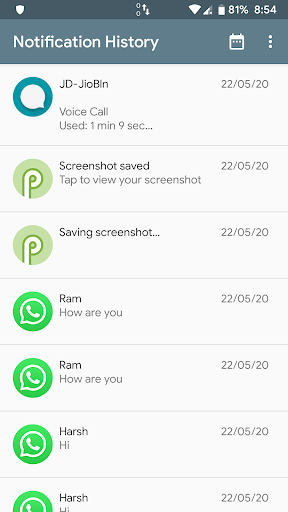
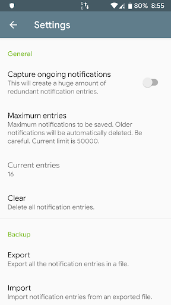

# NotificationHistory

**NotificationHistory** is an Android app that captures and saves all notifications received on your device's status bar. This allows you to review older or deleted notifications, including messages, chats, and any mistakenly dismissed push notifications.

## Features

- **Instant Notification Saving:** Automatically saves notifications as they arrive on your device.
- **Foreground Service:** Runs a foreground notification to ensure the app remains active and is not stopped in the background.
- **Export/Import Notifications:** Allows you to export and import notifications in JSON format for backup and restore purposes.
- **Filter by Date:** Easily filter and view notifications by date, making it simple to find what you're looking for.

## Screenshots
  
  
